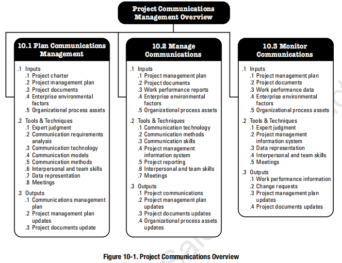
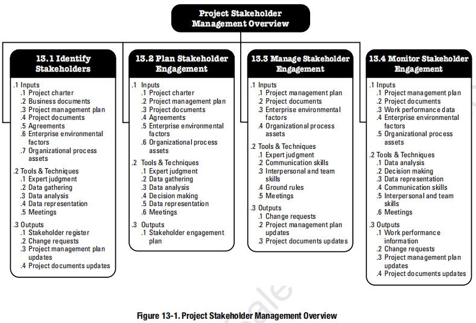

# 项目过程组与知识领域

项目管理知识领域是管理各种项目时需普遍使用的专业知识领域。
每个知识领域都是项目管 理中的一个特定主题，以及与该主题相关的一组过程。

# 十大知识领域

## 4. 整合管理（5）

### 制定项目管理计划

### 指导与管理项目工作

### 管理项目知识

### 监控项目工作

### 实施整体变更控制

### 结束项目或阶段

### 制定项目章程

## 5. 范围管理（6）

### 规划范围管理

### 收集需求

### 定义范围

### 创建WBS

### 确认范围

### 控制范围

## 6. 进度管理（6）

### 规划进度管理

### 定义活动

### 排列活动顺序

### 估算活动持续时间

### 制定进度计划

### 控制进度

## 7. 成本管理（4）

### 控制成本

### 规划成本管理

### 估算成本

### 制定预算

## 8. 质量管理（3）

### 控制质量

### 规划质量管理

### 管理质量

## 9. 资源管理（6）

### 控制资源

### 规划资源管理

### 估算活动资源

### 获取资源

### 建设团队

### 管理团队

## 10. 沟通管理（3）

### 监督沟通

### 规划沟通管理

### 管理沟通

## 11. 风险管理（7）

### 监督风险

### 规划风险管理

### 识别风险

### 实施定性风险分析

### 实施定量风险分析

### 规划风险应对

### 实施风险应对

## 12. 采购管理（3）

### 规划采购管理

### 实施采购

### 控制采购

## 13. 相关方管理（4）

### 识别相关方

### 规划相关方参与

### 管理相关方参与

### 监督相关方参与
